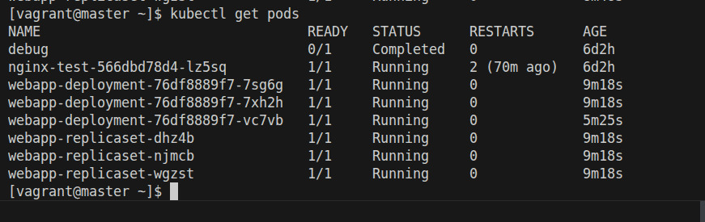

# Reporte - Laboratorio - Práctica Kubernetes

## Topología e Infraestructura (Vagrant y Ansible)

El entorno base para este despliegue se orquestó mediante "Infraestructura como Código" (IaC) utilizando Vagrant y Ansible, aprovisionando tres máquinas virtuales con Rocky Linux 9:

1. **Servidor Bastión (`bastion`)**: Funciona como nodo de gestión, servidor DNS y DHCP para la red privada (`lab_net`).
   - *Hardware:* 1 vCPU, 1GB RAM.
   - *Red:* IP Estática `192.168.10.10`.
   - *Acceso:* `vagrant ssh bastion`

2. **Nodo Maestro (`master`)**: Ejecuta el Plano de Control (Control Plane) de Kubernetes.
   - *Hardware:* 2 vCPUs, 2GB RAM.
   - *Red:* IP dinámica (DHCP) resuelta a `192.168.10.20`.
   - *Acceso:* `vagrant ssh master`

3. **Nodo de Trabajo (`worker`)**: Ejecuta las cargas de trabajo (Pods y contenedores).
   - *Hardware:* 1 vCPU, 2GB RAM.
   - *Red:* IP dinámica (DHCP) resuelta a `192.168.10.21`.
   - *Acceso:* `vagrant ssh worker`

El aprovisionamiento automatizado del clúster se gestionó a través de un playbook de Ansible (`site.yml`), el cual instaló dependencias, configuró containerd como *container runtime*, inicializó `kubeadm` en el maestro y unió el nodo worker de manera transparente.

## Flujo de Trabajo y Ejecución (Despliegue de la Aplicación)

Durante esta práctica de laboratorio, se llevó a cabo el despliegue exitoso de una aplicación contenerizada en un clúster auto-gestionado de Kubernetes, evidenciando el cumplimiento de todas las fases operativas:

### 1. Preparación y Construcción (Docker Build y Push)
Se empaquetó el código fuente de la aplicación web ("Hola Mundo" en Python/Flask) construyendo la imagen de Docker localmente. Posteriormente, se subió la imagen al repositorio público en Docker Hub para garantizar que los nodos del clúster pudieran descargarla. Una vez finalizado el proceso de publicación, ingresamos a la máquina virtual del nodo maestro (`master`) mediante SSH para gestionar la orquestación de la infraestructura.

### 2. Despliegue Declarativo y Validación de Réplicas (Fase 3 y 5)
Se aplicaron los manifiestos YAML (`kubectl apply -f .`), aprovisionando de manera atómica todos los recursos requeridos: Deployment, ReplicaSet, Secrets, ConfigMap y Service. Posteriormente, verificamos la correcta creación y el escalamiento a las réplicas configuradas.


*En la imagen se observa la salida de `kubectl get pods`, confirmando que todas las réplicas solicitadas (tanto del Deployment como del ReplicaSet) se encuentran en estado `Running`, evidenciando el correcto aprovisionamiento.*

### 3. Exposición de la Aplicación (Fase 4)
Para permitir el tráfico exterior hacia los pods, validamos la instanciación del servicio configurado como `NodePort`.


*Listado general de servicios (`kubectl get services`) comprobando la asignación del puerto externo 30001 (NodePort) mapeado al puerto interno 80.*


*Inspección detallada (`kubectl describe svc`) que evidencia los Endpoints (IPs privadas efímeras de los pods) que están recibiendo tráfico balanceado por este servicio.*

### 4. Prueba de Resiliencia y Self-Healing (Fase 6)
Se validó la capacidad de auto-recuperación intrínseca de Kubernetes mediante la eliminación deliberada de un pod en ejecución.


*La captura muestra la ejecución del comando `kubectl delete pod` y la subsecuente revisión, demostrando que el bucle de control del ReplicaSet reaccionó de manera inmediata generando una nueva réplica para mantener la alta disponibilidad sin intervención manual.*

### 5. Análisis y Telemetría (Retos Adicionales)
Como parte de las tareas complementarias, se inspeccionó la salida estándar del contenedor para asegurar la integridad de la inicialización de la aplicación.


*Visualización de telemetría (`kubectl logs`) confirmando que el servidor WSGI/Flask arrancó exitosamente y se encuentra a la escucha en el puerto 5000 dentro del contenedor.*

### 6. Verificación de Accesibilidad (Resultados Esperados)
El hito definitivo fue validar que el enrutamiento físico funcionaba de extremo a extremo a través de la red del clúster.


*Ejecución de una petición `curl` dirigida hacia la IP del nodo worker (`192.168.10.21`) sobre el puerto expuesto (`30001`), recibiendo exitosamente la respuesta HTTP generada por el script Python subyacente.*

---

# Kubernetes Application Deployment Lab
This lab demonstrates how to deploy a simple application using Kubernetes. The lab utilizes various Kubernetes resources such as Deployments, ReplicaSets, Services, Secrets, and ConfigMaps to deploy and manage the application.

## Prerequisites
Before starting this lab, you should have the following prerequisites installed:
- kubectl: Kubernetes command-line tool.
- Docker: Containerization platform to build and push container images.
## Description
In this lab, we deploy a simple web application to a Kubernetes cluster. The application consists of a backend service and a frontend interface. We utilize the following Kubernetes resources:
- Deployment: Manages the Pods and ReplicaSets, ensuring the desired number of Pod replicas are running.
- ReplicaSet: Ensures that a specified number of Pod replicas are running at all times.
- Service: Exposes the application to external traffic and provides load balancing.
- Secrets: Stores sensitive data such as credentials securely.
- ConfigMap: Stores non-sensitive configuration data for the application.
## Lab Structure
The lab repository contains the following files:

- webapp-deployment.yaml: Defines the Deployment for the application.
- webapp-service.yaml: Defines the Service to expose the application.
- webapp-configmap.yaml: Defines the ConfigMap for application configuration.
- webapp-dhsecret.yaml and webapp-dbsecret.yaml: Defines the Secrets for sensitive data storage.

## Steps

### Step 1: Create a Docker Image
1. Clone this repository to your local machine.
2. Navigate to the `K8S-apps` directory.
3. Build the Docker image using the provided Dockerfile:
    ```bash
    # docker build -t web-app .
    # docker tag webapp:latest <your-dockerhub-username>/webapp:v1
    ```
4. Push the Docker image to your Docker Hub repository:
    ```bash
    docker push <your-dockerhub-username>/webapp:v1
    ```

### Step 2: Update Deployment and ReplicaSet Configurations
1. Open files `app-deployment.yaml` and `app-replicaset.yaml` in the K8S_files directory.
2. Replace `<nombre_de_usuario_en_docker_hub>` with your Docker Hub username.
3. Replace `<nombre_del_repositorio>` with the name of your Docker Hub repository.
4. Replace `<tag>` with the desired tag for your image.
5. Save the changes.

### Step 3: Apply Kubernetes Configurations
Apply the Kubernetes configurations to deploy the application:
```bash
kubectl apply -f K8S_files/webapp-configmap.yaml
kubectl apply -f K8S_files/webapp-dhsecret.yaml
kubectl apply -f K8S_files/webapp-dbsecret.yaml
kubectl apply -f K8S_files/webapp-deployment.yaml
kubectl apply -f K8S_files/webapp-replicaset.yaml
kubectl apply -f K8S_files/webapp-service.yaml
 ```
### Step 4: Access the Application
Once the resources are deployed, you can access the application by finding the external IP of the Service:
```bash
kubectl get svc webapp-service
 ```
Then, open a web browser and navigate to http://<EXTERNAL_IP>:30001.

### Step 5:
To clean up the resources created in this lab, run the following command:
```bash
kubectl delete deployment webapp-deployment
kubectl delete replicaset webapp-replicaset
kubectl delete service webapp-service
kubectl delete configmap webapp-configmap
kubectl delete secret webapp-dhsecret webapp-dbsecret
 ```
## Additional Notes
You can customize the application by modifying the source code in the app directory.
Explore other Kubernetes resources and features to further enhance your understanding of Kubernetes.
