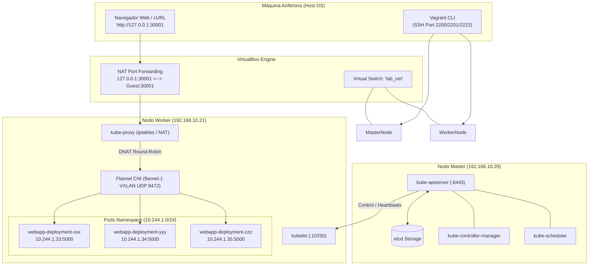

# Reporte Técnico Integral: Laboratorio de Despliegue en Kubernetes

Este repositorio contiene la arquitectura completa, aprovisionamiento de infraestructura como código (IaC), contenerización OCI y manifiestos de orquestación para el despliegue resiliente y seguro de una aplicación web distribuida en un clúster auto-gestionado de Kubernetes con `kubeadm`.

---

## 1. Topología de Infraestructura (Vagrant, VirtualBox y Ansible)

El entorno base se aprovisiona mediante Vagrant y Ansible sobre el hipervisor VirtualBox, implementando tres máquinas virtuales con **Rocky Linux 9 (x86_64)** interconectadas mediante una red interna conmutada (`lab_net`):

| Máquina Virtual | Rol en la Arquitectura | vCPU | RAM | Interfaz NAT (eth0) | Interfaz Interna (eth1) | Acceso CLI |
| :--- | :--- | :--- | :--- | :--- | :--- | :--- |
| **`bastion`** | Servidor de Gestión, DNS (BIND9) y DHCPd | 1 | 1024 MB | DHCP (`10.0.2.15/24`) | Estática: `192.168.10.10/24` | `vagrant ssh bastion` |
| **`master`** | Control Plane (API Server, etcd, Scheduler, CM) | 2 | 2048 MB | DHCP (`10.0.2.15/24`) | DHCP: `192.168.10.20/24` | `vagrant ssh master` |
| **`worker`** | Data Plane (Kubelet, Kube-Proxy, Flannel CNI) | 1 | 2048 MB | DHCP (`10.0.2.15/24`) | DHCP: `192.168.10.21/24` | `vagrant ssh worker` |

### Enrutamiento Físico y Reenvío de Puertos (Port-Forwarding)
Dado que la red `lab_net` está configurada como `virtualbox__intnet` (aislada dentro del conmutador virtual de VirtualBox sin interfaz directa en el sistema operativo anfitrión), se configuró una regla de reenvío de puertos NAT a nivel de hipervisor en el nodo `worker`:
- **Puerto Anfitrión (Host):** `127.0.0.1:30001`
- **Puerto Invitado (Guest):** `30001` (NodePort del servicio en `worker`)

---

## 2. Organización del Repositorio y Clean Architecture

El proyecto implementa los principios de **Clean Architecture** y **Separación de Responsabilidades (Separation of Concerns - SoC)** tanto a nivel de repositorio DevOps/Platform como a nivel del microservicio web:

```text
├── app/                          # [CAPA DE APLICACIÓN] Microservicio Web en Python
│   ├── Dockerfile                # Empaquetamiento OCI con usuario no-root
│   ├── .dockerignore             # Contexto de construcción mínimo (622 bytes)
│   ├── requirements.txt          # Dependencias fijadas (Flask==3.0.3)
│   ├── src/                      # Código fuente modularizado (Clean Architecture)
│   │   ├── domain/               # Entidades y reglas de negocio puras (Greeting, HealthStatus)
│   │   ├── application/          # Casos de uso desacoplados (GetGreetingUseCase, GetHealthUseCase)
│   │   ├── infrastructure/       # Adaptadores de entorno y configuración (AppConfig)
│   │   ├── presentation/         # Controladores HTTP y endpoints Flask (routes.py)
│   │   └── main.py               # Composition Root y fábrica create_app()
│   ├── tests/                    # Pruebas unitarias de casos de uso (sin dependencias web)
│   └── app.py                    # Entrypoint de ejecución local
├── k8s/                          # [CAPA DE PLATAFORMA] Manifiestos Declarativos Kubernetes
│   ├── webapp-configmap.yaml     # Configuración no confidencial (APP_ENV)
│   ├── webapp-dbsecret.yaml      # Credenciales de base de datos
│   ├── webapp-dhsecret.yaml      # Autenticación OCI (kubernetes.io/dockerconfigjson)
│   ├── webapp-deployment.yaml    # Workload con cgroups (requests/limits) y probes
│   ├── webapp-replicaset.yaml    # ReplicaSet desacoplado (app: hola-mundo-rs)
│   └── webapp-service.yaml       # Servicio NodePort (30001 -> 80 -> 5000)
├── infra/                        # [CAPA DE INFRAESTRUCTURA COMO CÓDIGO] IaC
│   └── ansible/                  # Automatización del clúster y servicios base
│       ├── ansible.cfg           # Configuración de ejecución de Ansible
│       ├── site.yml              # Playbook principal de aprovisionamiento
│       ├── group_vars/           # Variables de red, DNS BIND9 y DHCP
│       └── roles/                # Roles modulares (dhcpd, dns_bind, k8s_*)
├── docs/                         # [CAPA DE DOCUMENTACIÓN Y ACTIVOS]
│   ├── Instalacion Cluster Kubernetes.pdf # Guía de laboratorio de la actividad
│   └── images/                   # Evidencias fotográficas de ejecución
├── Vagrantfile                   # Orquestación de máquinas virtuales con VirtualBox
├── .gitignore                    # Exclusión de binarios, .vagrant y __pycache__
└── README.md                     # Documentación técnica central del proyecto
```

---

## 3. Diagrama de Arquitectura y Planos del Clúster



---

## 4. Seguridad, Optimización OCI y Código de Aplicación

### A. Contexto de Construcción y Seguridad OCI (`.dockerignore` y `Dockerfile`)
1. **Minimización de Superficie de Ataque (`.dockerignore`):**
   Se previene la fuga involuntaria de artefactos confidenciales (historial `.git/`, llaves privadas SSH en `.vagrant/`, capturas y archivos YAML de infraestructura). El contexto de construcción se optimizó de ~10 MB a solo **622 bytes**.
2. **Ejecución con Mínimo Privilegio (Non-root):**
   El contenedor ya no corre como `root`. Se creó el usuario de sistema `appuser` con `UID 10001`:
   ```dockerfile
   FROM python:3.9-slim
   WORKDIR /app
   RUN useradd -u 10001 -m appuser
   COPY requirements.txt /app/
   RUN pip install --no-cache-dir -r requirements.txt
   COPY app/ /app/app/
   COPY app.py /app/
   USER 10001
   EXPOSE 5000
   CMD ["python", "app.py"]
   ```
3. **Fijación Determinista de Dependencias (`requirements.txt`):**
   Se garantiza reproducibilidad e inmutabilidad fijando `Flask==3.0.3`.

### B. Aplicación Web y Telemetría de Salud (`app.py`)
- **Mitigación RCE:** Se eliminó la directiva `debug=True` que habilitaba el depurador interactivo de Werkzeug en interfaces públicas.
- **Consumo Real de ConfigMaps y Secrets:** El microservicio lee dinámicamente las variables de entorno inyectadas por Kubernetes (`APP_ENV` y `DB_USERNAME`).
- **Endpoint de Sondas (`/healthz`):** Expone un endpoint HTTP 200 con payload JSON `{"status":"healthy"}` para verificar liveness y readiness sin generar sobrecarga.

---

## 5. Manifiestos y Recursos de Kubernetes (`k8s/` y `K8S_files/`)

1. **`webapp-configmap.yaml`:**
   Define la variable no confidencial `APP_ENV: production`.
2. **`webapp-dbsecret.yaml`:**
   Almacena las credenciales de base de datos (`db_username: admin`, `db_userpassword: password`) codificadas en base64 bajo un secreto tipo `Opaque`.
3. **`webapp-dhsecret.yaml`:**
   Configurado con el estándar OCI `type: kubernetes.io/dockerconfigjson` para autenticación segura contra Docker Hub.
4. **`webapp-deployment.yaml`:**
   - **Replicas:** 3 Pods en alta disponibilidad.
   - **Límites cgroups:** `requests` (50m CPU, 64Mi RAM) y `limits` (200m CPU, 128Mi RAM) para prevenir *Out-Of-Memory* (OOMKill) en el nodo worker de 2GB.
   - **Probes:** `livenessProbe` (cada 10s) y `readinessProbe` (cada 5s) monitoreando `/healthz` en el puerto 5000.
5. **`webapp-replicaset.yaml`:**
   Desacoplado bajo la etiqueta `app: hola-mundo-rs` para evitar contiendas y condiciones de carrera con el bucle de reconciliación del `deployment-controller`.
6. **`webapp-service.yaml`:**
   Servicio de tipo `NodePort` mapeando el puerto externo `30001` hacia el puerto `80` del servicio y balanceando por DNAT al puerto `5000` de los Pods.

---

## 6. Evidencias del Laboratorio (Fases Operativas)

### Fase 1: Despliegue Declarativo y Réplicas (Fases 3 y 5)
Aprovisionamiento atómico de todos los recursos requeridos y validación del escalamiento a 3 réplicas en ejecución:


*Salida de `kubectl get pods` confirmando estado `Running` en los Pods distribuidos.*

### Fase 2: Exposición del Servicio NodePort (Fase 4)
Exposición de la capa de transporte exterior hacia la red del clúster:


*Listado general (`kubectl get services`) comprobando el NodePort 30001 mapeado al puerto 80.*


*Detalle de `kubectl describe svc webapp-service` evidenciando los Endpoints efímeros de los Pods recibiendo tráfico.*

### Fase 3: Resiliencia y Auto-Recuperación (Self-Healing) (Fase 6)
Eliminación deliberada de un Pod para verificar el bucle de control del orquestador:


*Eliminación de un pod con `kubectl delete pod` y generación inmediata de un nuevo reemplazo por el controlador.*

### Fase 4: Telemetría y Logs del Contenedor
Inspección de la salida estándar del runtime:


*Telemetría (`kubectl logs`) confirmando la inicialización en el puerto 5000 dentro del contenedor.*

---

## 7. Runbook de Pruebas y Validación Operativa

Ejecuta la siguiente batería técnica para auditar y verificar el funcionamiento completo:

### Prueba A: Verificación del Estado del Clúster
- **Entorno:** Nodo `master`
- **Acceso:** `vagrant ssh master`
- **Comandos:**
  ```bash
  kubectl get nodes -o wide
  kubectl get pods -o wide
  kubectl get svc webapp-service
  ```
- **Criterio de Aceptación:** Nodos en estado `Ready`, Pods en `Running` (1/1 READY) y servicio `NodePort` en puerto `30001`.

### Prueba B: Petición HTTP Interna (Red Overlay SDN)
- **Entorno:** Nodo `master`
- **Comandos:**
  ```bash
  # Petición a la aplicación principal
  curl -s http://192.168.10.21:30001

  # Petición al endpoint de telemetría de salud
  curl -s http://192.168.10.21:30001/healthz
  ```
- **Resultado Esperado:**
  ```text
  ¡Hola Mundo desde Kubernetes! [Entorno: production | DB User: admin]
  {"status":"healthy"}
  ```


*Ejecución exitosa de la consulta HTTP interna.*

### Prueba C: Petición HTTP Externa (Desde la Máquina Anfitriona)
- **Entorno:** Terminal o Navegador de tu PC anfitriona (Host OS).
- **Comando en Terminal Host:**
  ```bash
  curl -i http://127.0.0.1:30001
  ```
- **Acceso vía Navegador:** Abre Google Chrome, Firefox o Edge y accede a:
  `http://localhost:30001` o `http://127.0.0.1:30001`
- **Resultado Esperado:**
  ```http
  HTTP/1.1 200 OK
  Server: Werkzeug/3.1.9 Python/3.9.25
  Content-Type: text/html; charset=utf-8

  ¡Hola Mundo desde Kubernetes! [Entorno: production | DB User: admin]
  ```

---

## 8. Procedimiento de Despliegue y Limpieza

### Ciclo de Construcción y Publicación de la Imagen Docker
```bash
# Construcción local aplicando .dockerignore y requisitos fijados
docker build -t <tu_usuario_dockerhub>/webapp-hola-mundo:v2 .

# Publicación al registro OCI
docker push <tu_usuario_dockerhub>/webapp-hola-mundo:v2
```

### Aplicación Declarativa de Manifiestos
```bash
# Aplicar infraestructura declarativa en el master
kubectl apply -f K8S_files/webapp-configmap.yaml
kubectl apply -f K8S_files/webapp-dhsecret.yaml
kubectl apply -f K8S_files/webapp-dbsecret.yaml
kubectl apply -f K8S_files/webapp-deployment.yaml
kubectl apply -f K8S_files/webapp-replicaset.yaml
kubectl apply -f K8S_files/webapp-service.yaml

# Comprobar el rollout del Deployment
kubectl rollout status deployment webapp-deployment
```

### Limpieza de Recursos (Teardown)
```bash
kubectl delete deployment webapp-deployment
kubectl delete replicaset webapp-replicaset
kubectl delete service webapp-service
kubectl delete configmap webapp-configmap
kubectl delete secret regcred db-secrets
```
